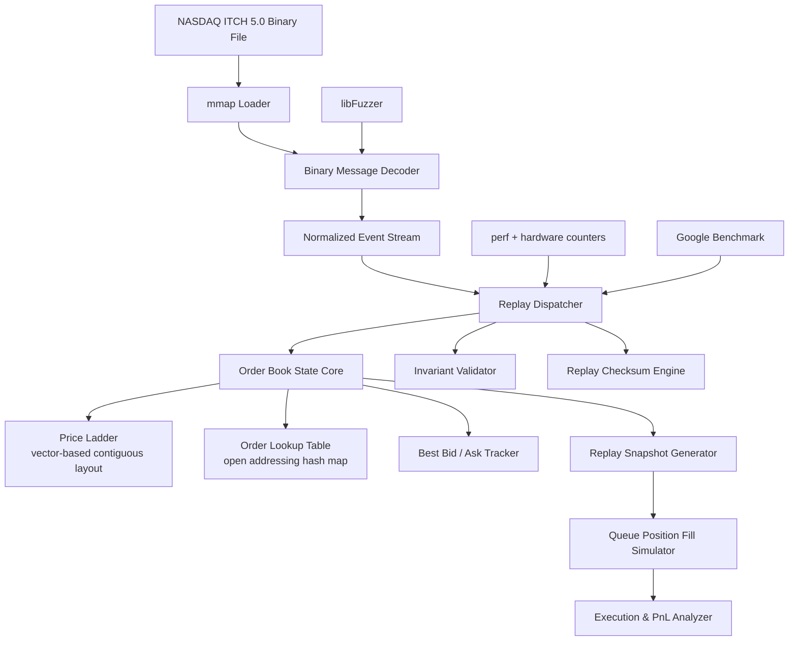

# PRD.md — NASDAQ ITCH 5.0 Market Data Replay Platform

## 1. Overview

This project reconstructs a full NASDAQ TotalView-ITCH 5.0 limit order book from historical binary market data using a deterministic, cache-aware, zero-allocation replay pipeline.

The system emphasizes:

* deterministic event replay
* microarchitectural efficiency (cache, branch, TLB)
* contiguous memory layouts
* realistic queue-position execution modeling
* reproducible performance benchmarking

It is designed as a quantitative development systems project demonstrating:

* low-latency C++ engineering
* exchange protocol parsing
* memory allocator design
* performance profiling discipline
* market microstructure understanding

---

## 2. Problem Statement

Electronic markets generate high-frequency binary feeds that encode all order book state changes.

Correct reconstruction requires:

* strict ordering of events
* correct price-time priority
* efficient memory management
* deterministic state evolution
* accurate modeling of passive execution dynamics

Most naive implementations:

* use `std::map` for book state
* allocate per order on heap
* use floating-point prices
* ignore queue position effects
* produce non-reproducible simulations

This system avoids those limitations by design.

---

## 3. Goals

### 3.1 Functional Goals

* Parse NASDAQ ITCH 5.0 binary feed using `mmap` (zero-copy)
* Support all core message types:

  * Add Order (A/F)
  * Execute (E/C)
  * Cancel (X)
  * Delete (D)
  * Replace (U)
* Reconstruct full limit order book state
* Maintain order lifecycle correctness
* Maintain O(1) order lookup
* Maintain best bid/ask in constant time

---

### 3.2 Performance Goals

* ≥ 5M events/sec sustained throughput
* p99 event latency < 400 ns
* p50 latency < 120 ns
* p99.9 latency < 700 ns
* < 2% L1 data cache miss rate
* < 1% branch misprediction rate
* zero heap allocations on replay hot path

---

### 3.3 Correctness Goals

* Deterministic replay: identical input → identical state evolution
* Bitwise reproducible snapshots
* Strict invariant enforcement in debug mode
* No invalid order book states

---

## 4. Non-Goals

* live trading or exchange connectivity
* order routing systems
* multi-asset portfolio simulation
* alpha generation or trading strategies
* distributed systems architecture
* risk management layer
* ML-based prediction models

---

## 5. System Architecture



---

## 6. Core Data Flow

1. Load ITCH file via `mmap`
2. Sequentially parse binary messages
3. Decode into normalized Event structure
4. Dispatch into replay pipeline
5. Mutate order book state
6. Update snapshot engine
7. Validate invariants and checksum periodically

---

## 7. Component Specifications

---

## 7.1 ITCH 5.0 Binary Parser

### Design Goals

* zero-copy parsing
* no heap allocation
* strict big-endian decoding
* sequential memory access
* branch-predictable dispatch

---

### Raw ITCH Structures

```cpp
#pragma pack(push, 1)

struct ITCHAddOrder {
    uint16_t length;
    uint8_t  message_type;
    uint16_t stock_locate;
    uint16_t tracking_number;
    uint8_t  timestamp[6];
    uint64_t order_reference;
    char     side;
    uint32_t shares;
    char     stock[8];
    uint32_t price;
};

struct ITCHOrderExecuted {
    uint16_t length;
    uint8_t  message_type;
    uint16_t stock_locate;
    uint16_t tracking_number;
    uint8_t  timestamp[6];
    uint64_t order_reference;
    uint32_t executed_shares;
    uint64_t match_number;
};

struct ITCHOrderCancel {
    uint16_t length;
    uint8_t  message_type;
    uint16_t stock_locate;
    uint16_t tracking_number;
    uint8_t  timestamp[6];
    uint64_t order_reference;
    uint32_t cancelled_shares;
};

struct ITCHOrderDelete {
    uint16_t length;
    uint8_t  message_type;
    uint16_t stock_locate;
    uint16_t tracking_number;
    uint8_t  timestamp[6];
    uint64_t order_reference;
};

struct ITCHOrderReplace {
    uint16_t length;
    uint8_t  message_type;
    uint16_t stock_locate;
    uint16_t tracking_number;
    uint8_t  timestamp[6];
    uint64_t original_reference;
    uint64_t new_reference;
    uint32_t shares;
    uint32_t price;
};

#pragma pack(pop)
```

---

### Normalized Event

```cpp
struct Event {
    enum Type : uint8_t {
        ADD, EXECUTE, CANCEL, DELETE, REPLACE, TRADE
    };

    Type type;

    uint64_t order_ref;
    uint64_t timestamp_ns;

    int64_t price;
    uint32_t quantity;

    char side;
};
```

---

### Feed Loader Constraints

* mmap-based file access only
* MADV_SEQUENTIAL optimization
* strict sequential pointer advancement
* no intermediate buffers

---

### Key Invariants

* message boundaries must never be violated
* unknown message types must be safely skipped

### Timestamp Decoding

ITCH timestamps are 6-byte big-endian nanosecond offsets from midnight of the trading day.
The `uint8_t timestamp[6]` field must be reconstructed as follows:

```cpp
inline uint64_t decode_timestamp(const uint8_t ts[6]) noexcept {
    uint64_t ns = 0;
    for (int i = 0; i < 6; ++i) ns = (ns << 8) | ts[i];
    return ns;
}
```

This is a correctness-critical path. Off-by-one byte shifts produce silently wrong
timestamps that corrupt event ordering. Validate against known message timestamps
from NASDAQ's sample data in unit tests.

---

## 7.2 Slab Allocator

### Design Goals

* constant-time allocation/deallocation
* zero fragmentation
* contiguous memory layout
* cache-line aligned Order objects

---

### Order Layout

```cpp
struct alignas(64) Order {
    uint64_t order_ref;
    int64_t  price;
    uint32_t quantity;
    uint32_t original_quantity;
    uint32_t queue_position;
    uint8_t  side;
    uint8_t  _pad[3];

    // Dual-use pointers:
    // - When order is LIVE: next/prev link this order within its price level's
    //   intrusive doubly-linked list (price-time priority queue).
    // - When order is FREE: next is the slab free-list chain pointer;
    //   prev is unused (poisoned to 0xDEADDEADDEADDEAD in debug builds).
    Order* next;
    Order* prev;

    uint32_t slab_index;
    uint8_t _pad2[12];
};
```

### Pointer Lifecycle Invariant

A given `Order*` is in exactly one of two states at all times:

* **Live**: owned by a price level's intrusive list; `next`/`prev` are list pointers.
* **Free**: on the slab free list; `next` is the free-list chain; `prev` is `0xDEADDEADDEADDEAD` in debug builds.

Transitions: `Slab::allocate()` → Live. `Slab::free()` → Free. No other transitions are valid.

---

### Properties

* 1M preallocated orders per slab
* intrusive free list
* O(1) allocation and deallocation
* debug-mode double-free detection via pointer poisoning
* no heap allocation after initialization

---

## 7.3 Price Ladder

### Indexing Scheme

ITCH 5.0 prices are 32-bit unsigned integers in units of $0.0001 (4 decimal fixed-point).
Price range per symbol is bounded in practice (e.g., a $50 stock ticks between ~$30–$70
intraday, a range of 400,000 ticks). Use a **fixed-range contiguous array** indexed by
absolute price tick:

```cpp
struct PriceLadder {
    static constexpr uint32_t MAX_TICKS = 1 << 20; // ~$104 range at $0.0001/tick; tune per symbol
    std::array<PriceLevel, MAX_TICKS> levels;       // arena-allocated, not heap
    uint32_t best_bid_tick;
    uint32_t best_ask_tick;
};
```

Index directly: `levels[price_tick]`. O(1) access, zero pointer chasing, sequential
scan for depth-of-book is cache-linear.

### Memory Budget

If `PriceLevel` is 64 bytes and `MAX_TICKS = 1 << 20`:

* 64 MB per symbol ladder — acceptable for single-symbol replay.
* For multi-symbol: allocate per-symbol lazily from an arena; evict inactive symbols.

### Rationale

* O(1) access by price tick — no binary search, no hash collision
* Sequential traversal for top-of-book is cache-linear
* Eliminates pointer chasing vs. `std::map`
* Branch-predictable: no collision resolution, no rebalancing

### Avoid

* `std::map` in hot path (pointer chasing, allocations, O(log n))
* Sorted `std::vector` with binary search (O(log n) insert/delete)
* Hash map for price levels (destroys level traversal locality)

---

## 7.4 Order Lookup Table

### Requirements

* map `order_ref → Order*`
* open addressing with **Robin Hood hashing**
* no pointer-chained buckets (destroys cache locality)
* preallocated to 2M slots (covers 1M live orders at 0.5 load factor)
* max load factor: 0.7 — rehash is forbidden on hot path; preallocate for worst case

### Hash Function

ITCH order reference numbers are assigned sequentially by NASDAQ with small gaps.
Use a fast integer mixing function to avoid clustering:

```cpp
inline uint64_t hash_order_ref(uint64_t ref) noexcept {
    ref ^= ref >> 33;
    ref *= 0xff51afd7ed558ccdULL;
    ref ^= ref >> 33;
    return ref;
}
```

(Murmur3 finalizer — low latency, good avalanche for sequential keys.)

### Probe Sequence

Linear probing with Robin Hood displacement. On insert, if the probe distance of
the incoming key exceeds the probe distance of the resident key, swap — this bounds
worst-case lookup to O(mean displacement) ≈ O(1) in practice and eliminates long probe chains.

### Invariant

Table capacity is fixed at initialization. Any insertion attempt beyond 0.7 load
factor must `assert`-fail in debug builds. Size the initial capacity to the maximum
expected concurrent live orders for the target dataset.

---

## 7.5 Queue Position Fill Simulator

### Objective

Model execution probability using:

* queue position tracking
* cancellation-adjusted queue movement
* partial fill execution
* passive order prioritization

---

### Key Insight

Naive fill models assume: "any trade at price = fill."

This overestimates fill probability and therefore overstates backtest profitability.

Correct model accounts for:

* queue position at time of order entry
* queue erosion from preceding cancellations
* queue erosion from preceding executions
* passive execution priority (only orders ahead in queue fill first)

### Queue Position Update Rules

```
On ADD at price P:          queue_position = current_depth(P, side)
On EXECUTE at price P:      for all orders at P with queue_pos > 0: queue_pos -= min(executed_qty, queue_pos)
On CANCEL at price P:       for all orders at P behind cancelled order: queue_pos -= cancelled_qty
On REPLACE (order O → O'):  O' gets queue_pos = current_depth(P', side')  [loses priority]
```

### Fill Decision

A simulated passive order at price P is filled when:

```
cumulative_executed_qty_at_P >= order.queue_position + order.quantity
```

This is the conservative, correct condition. Any model that fills on "trade at P" without
tracking queue position is wrong for strategy evaluation purposes.

---

## 7.6 Adverse Selection Model

> **Scope: Post-MVP.** Not required for Definition of Done.
> Tracked separately. Do not implement until queue-position simulator is validated.

### Future Work

When the queue-position simulator is stable, extend with:

* Conditioning on order book imbalance at fill time
* Spread regime classification (wide vs. tight)
* Aggressor flow toxicity proxy
* Short-term realized volatility at fill

The MVP fill model assumes zero adverse selection. This is explicitly conservative
and understood to overstate fill quality. Document this assumption in all benchmark output.

---

## 8. Invariants

All invariants enforced in debug mode:

* `best_bid < best_ask`
* no negative queue position
* no unknown order corruption
* slab refcount ∈ {0, 1}
* no floating-point price usage anywhere in the pipeline
* deterministic replay hash consistency across runs
* order counts match structural representation
* no order_ref appears in lookup table with state = Free
* timestamp strictly monotonically non-decreasing within a session

---

## 9. Performance Targets

### Reference Hardware

All targets are defined relative to:

| Field         | Spec                                    |
| ------------- | --------------------------------------- |
| CPU           | Intel Core i7-12700K or equivalent      |
| Base clock    | ≥ 3.6 GHz                               |
| L1d cache     | 48 KB per core                          |
| LLC           | ≥ 12 MB                                 |
| RAM           | DDR5-4800 or equivalent                 |
| OS            | Linux, kernel ≥ 5.15                    |
| Core affinity | isolated core, `SCHED_FIFO`, IRQ pinned |
| ASLR          | disabled for benchmark runs             |

Benchmarks run on hardware deviating from this spec must document the delta
and adjust targets proportionally.

### Targets

| Metric                      | Target          |
| --------------------------- | --------------- |
| Throughput                  | ≥ 5M events/sec |
| p50 latency                 | < 120 ns        |
| p99 latency                 | < 400 ns        |
| p99.9 latency               | < 700 ns        |
| L1 cache miss rate          | < 2%            |
| branch miss rate            | < 1%            |
| heap allocations (hot path) | 0               |

---

## 10. Benchmarking Requirements

All benchmarks must include:

* CPU model and microarchitecture
* compiler version and exact optimization flags
* dataset name, event count, and file checksum
* core affinity configuration
* ASLR status
* kernel version
* median, p50, p99, p99.9 latency
* throughput (events/sec)
* perf counter summary (IPC, L1d misses, branch misses, LLC misses)

No benchmark result is valid without full reproducibility metadata. Results without
this metadata must not be cited in README or resume materials.

---

## 11. Profiling Workflow

1. Run full replay benchmark with Google Benchmark
2. Collect perf counters: `perf stat -e cycles,instructions,cache-misses,branch-misses`
3. Generate flamegraph via `perf record -g` + `flamegraph.pl`
4. Identify CPI hotspots (high cycles-per-instruction regions)
5. Isolate single bottleneck — do not optimize multiple things simultaneously
6. Revalidate deterministic replay checksum after each change
7. Re-run full benchmark suite and record delta
8. Commit optimization with before/after perf numbers in commit message
9. Iterate

---

## 12. Tech Stack

* C++20 (core implementation)
* CMake + Ninja (build system)
* Google Benchmark (performance)
* perf + flamegraphs (profiling)
* GoogleTest (unit testing)
* libFuzzer (fuzz testing)
* ASan / UBSan (debug builds)
* Python 3.10+ (mock data generation, analysis layer)

---

## 12.5 Mock Data Generation

The full dataset (`01302019.NASDAQ_ITCH50`) is 11 GB. For unit tests, CI, and
iterative development, use a synthetic ITCH 5.0 stream generator.

### Script: `scripts/gen_mock_itch.py`

**Purpose:** Generate a deterministic, well-formed synthetic ITCH 5.0 binary file
of configurable size for use in parser tests, allocator stress tests, and benchmark
calibration.

**Invocation:**

```bash
python scripts/gen_mock_itch.py \
    --output data/mock.NASDAQ_ITCH50 \
    --num-events 1000000 \
    --num-symbols 10 \
    --seed 42 \
    --price-center 500000 \
    --price-range  50000
```

Arguments:

| Flag             | Description                                          | Default   |
| ---------------- | ---------------------------------------------------- | --------- |
| `--output`       | Output file path                                     | required  |
| `--num-events`   | Total number of ITCH messages to generate            | 1,000,000 |
| `--num-symbols`  | Number of distinct stock symbols                     | 10        |
| `--seed`         | RNG seed for deterministic output                    | 42        |
| `--price-center` | Center price in fixed-point ($0.0001 units)          | 500000    |
| `--price-range`  | Half-range of price variation in fixed-point units   | 50000     |
| `--validate`     | After writing, re-parse file and verify round-trip   | false     |

**Required behavior:**

1. **Deterministic output** — identical `--seed` produces bitwise identical files.
2. **Valid ITCH 5.0 framing** — every message has correct `length` prefix, correct
   `message_type` byte, and correct big-endian field encoding (use `struct.pack('>...')`).
3. **Lifecycle correctness** — every generated `order_ref` follows a valid lifecycle:
   Add → (optional partial Cancel/Execute) → Delete or full Execute.
   No orphaned references. No double-deletes.
4. **Configurable message mix** — default ratio:

   | Type    | Share |
   | ------- | ----- |
   | Add (A) | 60%   |
   | Cancel (X) | 15% |
   | Execute (E) | 15% |
   | Delete (D) | 8%  |
   | Replace (U) | 2%  |

5. **Timestamps** — monotonically increasing 6-byte big-endian nanosecond offsets from midnight.
6. **Active order pool** — maintain a live order pool; draw randomly for cancel/execute/delete targets. Never reference an order_ref that has been deleted.

**Test sizes:**

| Purpose             | `--num-events` | Approx size |
| ------------------- | -------------- | ----------- |
| Unit / parser tests | 10,000         | ~500 KB     |
| Allocator stress    | 500,000        | ~25 MB      |
| Benchmark warm-up   | 1,000,000      | ~50 MB      |
| Full benchmark      | 10,000,000     | ~500 MB     |

Add `data/mock.NASDAQ_ITCH50` and all generated data files to `.gitignore`.
Commit the generator script, not the output.

---

## 13. Build Modes

| Mode        | Purpose                   | Key Flags                          |
| ----------- | ------------------------- | ---------------------------------- |
| Debug       | invariants + sanitizers   | `-O0 -g -fsanitize=address,undefined` |
| Validate    | deterministic correctness | `-O2 -DNDEBUG -DREPLAY_VALIDATE`   |
| Benchmark   | performance testing       | `-O3 -march=native -DNDEBUG`       |
| Profile     | perf + flamegraphs        | `-O2 -g -fno-omit-frame-pointer`   |

Never report performance numbers from Debug or Profile builds.
Benchmark mode is the only valid mode for performance claims.

---

## 14. Testing Strategy

### Unit Tests

* parser correctness for each message type (round-trip with mock data)
* timestamp decoding correctness against known values
* allocator: alloc/free/double-free detection
* order lifecycle: add → cancel → delete sequence validation
* hash map: insertion, lookup, eviction at boundary load factors
* price ladder: bid/ask update correctness after each event type

### Integration Tests

* full deterministic replay: run twice, compare checksums
* snapshot consistency: snapshot at N events, resume, verify state
* queue position: synthetic book with known fill sequence, verify fill times

### Fuzz Tests (libFuzzer)

* malformed ITCH streams: truncated messages, wrong length prefix, unknown type bytes
* random event sequences: out-of-order deletes, double-adds, replace to non-existent ref
* invalid lifecycle transitions: execute against deleted order, cancel > remaining quantity

### Performance Regression Tests

* throughput must not regress > 5% between commits on Benchmark build
* CI runs mock dataset (1M events); full dataset run is manual pre-release

---

## 15. Repository Constraints

### Allowed in Hot Path

* contiguous arrays
* fixed-size structs
* inline arithmetic
* `[[likely]]` / `[[unlikely]]` branch hints
* `__builtin_expect`

### Forbidden in Hot Path

* `std::string`
* `iostream`
* heap allocation (`new`, `malloc`, `std::make_unique`, etc.)
* `shared_ptr` / `unique_ptr`
* exceptions
* virtual dispatch
* mutexes or any synchronization primitives
* `std::map`, `std::unordered_map` (use custom open-addressing table)

Violations caught by: custom allocator shim that aborts on `new` in hot path (enabled in Validate build).

---

## 16. Milestones

### Phase 1 — Correctness Foundation

* ITCH 5.0 parser: all message types (A/F/E/C/X/D/U)
* Timestamp decoder with unit tests
* Basic order book reconstruction
* Snapshot validation + replay checksum
* Mock data generator (`scripts/gen_mock_itch.py`)

### Phase 2 — Memory Architecture

* Slab allocator with intrusive free list
* Robin Hood hash map for order lookup
* Deterministic replay enforcement (checksum across full dataset)
* ASan/UBSan clean under fuzz corpus

### Phase 3 — Market Microstructure

* Queue-position tracking per price level
* Cancellation-aware queue erosion model
* Fill simulator with correct passive execution logic
* Execution PnL analyzer

### Phase 4 — Performance Engineering

* Price ladder: fixed-range tick array
* Cache optimization pass (perf-guided)
* Flamegraph-driven hotspot resolution
* Full benchmark suite with reproducibility metadata
* Optimization report: before/after perf counters per change

---

## 17. Definition of Done

* Full deterministic replay of ITCH 5.0 dataset (checksum verified)
* ≥ 5M events/sec sustained throughput on reference hardware
* p99 latency < 400 ns
* < 2% L1 cache miss rate
* zero heap allocations in replay hot path (verified by allocator shim)
* ASan/UBSan clean under libFuzzer corpus (≥ 100K inputs)
* Reproducible benchmark suite with full hardware/compiler metadata
* Validated queue-position fill simulator (zero-adverse-selection baseline, documented)
* Flamegraph-backed optimization report with ≥ 3 profiling iterations
* `scripts/gen_mock_itch.py` with `--validate` flag passing
* README.md with architecture overview, build instructions, and benchmark results table
