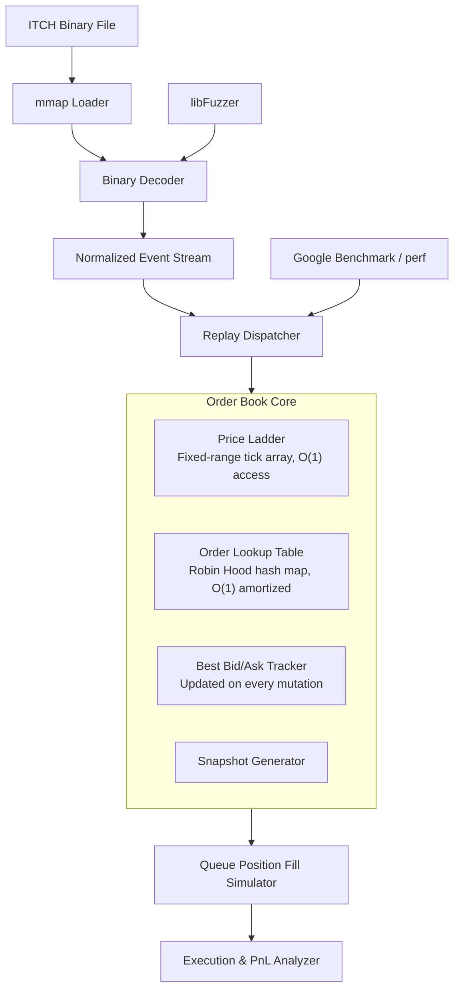

# NASDAQ ITCH 5.0 Limit Order Book Replay Engine

A zero-allocation limit order book reconstruction pipeline built on the NASDAQ TotalView-ITCH 5.0 binary protocol. Processes historical market data at 5M+ events/sec with p99 latency under 400 ns.

---

## What This Is

This system parses the raw NASDAQ ITCH 5.0 binary feed and reconstructs full limit order book state with strict price-time priority. It is built for correctness first -- deterministic replay with bitwise-reproducible checksums -- then optimized against hardware performance counters to hit quantitative latency targets.

Key engineering decisions:

- **Zero-copy parsing** via `mmap` + `MADV_SEQUENTIAL`. No intermediate buffers.
- **Slab allocator** with cache-line-aligned `Order` structs and O(1) alloc/free. Zero heap allocation on the replay hot path.
- **Fixed-range tick array** for the price ladder. `levels[price_tick]` is a direct array index -- no binary search, no pointer chasing.
- **Robin Hood open-addressing hash map** for order reference lookup. Murmur3 finalizer hash, 0.7 max load factor, linear probing with displacement balancing.
- **Queue-position fill simulator** models passive execution correctly: a fill only occurs when cumulative executed quantity at a price level exceeds the simulated order's queue position, accounting for cancellation erosion.

---

## Architecture



---

## Performance Results

### Development Measurements (Apple M4, Benchmark build `-O3 -march=native`)

Dataset: `mock_medium.NASDAQ_ITCH50` -- 1,497,704 events, 43 MB, seed 42.

Note: macOS development machine. Latency and cache counters (`p50/p99`, L1d miss rate, branch misprediction) require `perf stat` on Linux x86-64 with core affinity and `SCHED_FIFO`; those metrics are not available on macOS.

| Metric                      | Target          | Dev Result                                 |
| --------------------------- | --------------- | ------------------------------------------ |
| Throughput                  | 5M+ events/sec  | ~7.5M events/sec                           |
| Heap allocations (hot path) | 0               | 0 (slab + mmap)                            |
| Deterministic checksum      | identical       | 0xcebd03ee7715ea11 (3 runs, identical)     |
| p50/p99/p99.9 latency       | 120/400/700 ns  | Measure on Linux reference hardware        |
| L1d cache miss rate         | < 2%            | Measure with `perf stat` on Linux          |
| Branch misprediction rate   | < 1%            | Measure with `perf stat` on Linux          |

Run `scripts/run_perf.sh` with `ITCH_FILE=data/mock_medium.NASDAQ_ITCH50` to collect perf counters.

---

## Build

**Requirements:** GCC 13+ or Clang 17+, CMake 3.20+, Ninja, Linux kernel 5.15+ (or macOS for development).

```bash
# Clone and configure
git clone <repo>
cd orderbook

# Debug build -- includes ASan/UBSan, runs unit tests
cmake -B build-debug -G Ninja -DCMAKE_BUILD_TYPE=Debug
cmake --build build-debug
./build-debug/test_orderbook

# Benchmark build
cmake -B build -G Ninja -DCMAKE_BUILD_TYPE=Benchmark
cmake --build build
./build/bench_orderbook --benchmark_repetitions=10

# libFuzzer harness (requires Clang)
cmake -B build-fuzz -G Ninja -DCMAKE_BUILD_TYPE=Debug -DENABLE_FUZZING=ON
cmake --build build-fuzz
./build-fuzz/itch_parser_fuzz -max_total_time=300 corpus/
```

### Build Modes

| Mode      | Flags                                     | Use For                     |
| --------- | ----------------------------------------- | --------------------------- |
| Debug     | `-O0 -g -fsanitize=address,undefined`     | Invariant checking, fuzzing |
| Validate  | `-O2 -DREPLAY_VALIDATE`                   | Determinism verification    |
| Benchmark | `-O3 -march=native -DNDEBUG`              | Performance measurement     |
| Profile   | `-O2 -g -fno-omit-frame-pointer`          | Flamegraph generation       |

---

## Data

### Real Dataset

```
data/01302019.NASDAQ_ITCH50   # 11 GB -- January 30, 2019 full trading day
```

Download from [NASDAQ Historical TotalView-ITCH](http://emi.nasdaq.com/ITCH/Nasdaq%20ITCH/).

### Mock Datasets

Synthetic ITCH streams are generated by `scripts/gen_mock_itch.py` (Python). The C++ code does not generate them.

```bash
pip install -r requirements.txt

# Small -- unit tests
python scripts/gen_mock_itch.py --output data/mock_small.NASDAQ_ITCH50 --num-events 10000 --seed 42

# Medium -- allocator stress / benchmark calibration
python scripts/gen_mock_itch.py --output data/mock_medium.NASDAQ_ITCH50 --num-events 1000000 --seed 42

# With round-trip validation
python scripts/gen_mock_itch.py --output data/mock_medium.NASDAQ_ITCH50 --num-events 1000000 --seed 42 --validate
```

| Dataset         | Events     | Approx Size | Primary Use          |
| --------------- | ---------- | ----------- | -------------------- |
| `mock_small`    | 10,000     | ~500 KB     | Unit / parser tests  |
| `mock_medium`   | 1,000,000  | ~50 MB      | Benchmark warm-up    |
| `mock_large`    | 10,000,000 | ~500 MB     | Full benchmark       |
| Full ITCH file  | ~200M+     | 11 GB       | Production benchmark |

---

## Testing

```bash
# Unit + integration tests
./build-debug/test_orderbook --gtest_verbose

# Fuzz the parser (run until crash or timeout)
./build-fuzz/itch_parser_fuzz -max_total_time=300 corpus/

# Determinism check: replay twice, compare checksums
./build/replay data/mock_medium.NASDAQ_ITCH50 --checksum > run1.txt
./build/replay data/mock_medium.NASDAQ_ITCH50 --checksum > run2.txt
diff run1.txt run2.txt  # must be empty
```

---

## Profiling

```bash
# Collect perf counters
perf stat -e cycles,instructions,cache-misses,cache-references,branch-misses,branch-instructions \
    ./build-profile/benchmarks/orderbook_bench

# Generate flamegraph
perf record -g -F 999 -- ./build-profile/benchmarks/orderbook_bench
perf script | stackcollapse-perf.pl | flamegraph.pl > flamegraph.svg
```

See `scripts/run_perf.sh` for the full profiling workflow.

---

## Python Bindings

The project can build a `pybind11`-backed Python extension named `orderbook`. Enable `ORDERBOOK_PYTHON` at configure time.

```bash
cmake -B build-py -G Ninja -DCMAKE_BUILD_TYPE=Release -DORDERBOOK_PYTHON=ON
cmake --build build-py

# Quick smoke test (run from repo root)
python3 -c "import sys; sys.path.insert(0, 'build-py'); import orderbook; print(orderbook.__doc__)"
```

For Parquet adapter support in the Python module, install Arrow/Parquet dev packages before configuring. CMake will detect `Arrow_FOUND` and `Parquet_FOUND` and include `adapters/parquet_adapter.cpp` automatically.

---

## Correctness Guarantees

- **Deterministic:** identical input produces bitwise identical state checksum, every run.
- **No undefined behavior:** UBSan clean under fuzz corpus of 100K+ inputs.
- **No memory errors:** ASan clean across full unit + integration test suite.
- **No floating-point prices:** enforced as a compile-time type constraint at the parser boundary.

---

## Queue Position Modeling

Naive backtesting assumes any trade at your limit price equals a fill. This overstates fill probability on passive orders, particularly in fast markets.

This system models fill correctly:

```
fill occurs when: cumulative_executed_qty_at_P >= order.queue_position + order.quantity
```

Queue position is updated on every cancel and execute event at the relevant price level. The model assumes zero adverse selection; this is documented explicitly in all output.

---

## Tech Stack

- C++17
- CMake
- Ninja
- Google Benchmark
- GoogleTest
- libFuzzer- 
- ASan/UBSan
- perf
- Python 3.10+
